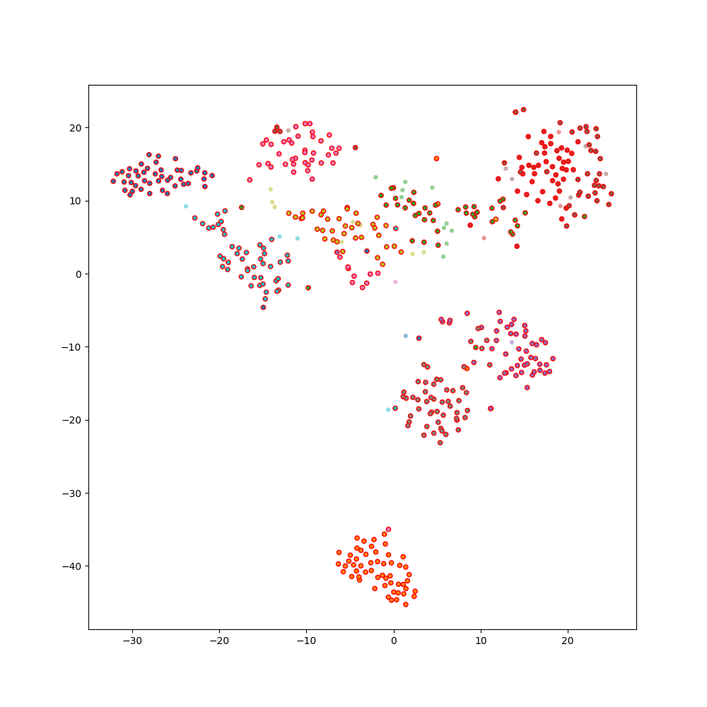

# DeepFA: "Deep Feature Annotation" 

A Python implementation of the proposed method Deep Feature Annotation (DeepFA) [1,2]. DeepFA aims to obtain pseudo labels from a very small supervised set of images from a large set of unsupervised ones. DeepFA uses VGG-16 to learn the features from images; the tSNE algorithm projects those features in a 2D space; OPFSemipseudo labels the unsupervised samples from the unsupervised ones. The most confident pseudo labels are used to feed the VGG-16 in the next DeepFA iteration. Details of the method, as well as the experiments and evaluation for distinct datasets, can be found in [1,2].

Pseudolabels on a small subset of MNIST dataset can be obtained with DeepFA using the provided code example. The percentage of the initial supervised samples is randomly chosen, and different confidence values can be tested as in [2].


[1] Benato, B. C., Gomes, J. F., Telea, A. C., Falcão, A. X. "Semi-supervised deep learning based on label propagation in a 2D embedded space." Iberoamerican Congress on Pattern Recognition. Springer, Cham, 2021. ([pdf](https://www.ijcai.org/proceedings/2017/0345.pdf))

[2] Benato, B. C., Telea, A. C., Falcão, A. X. "Iterative Pseudo-Labeling with Deep Feature Annotation and Confidence-Based Sampling." 2021 34th SIBGRAPI Conference on Graphics, Patterns and Images (SIBGRAPI). IEEE, 2021. ([pdf](http://sibgrapi.sid.inpe.br/col/sid.inpe.br/sibgrapi/2021/09.06.19.40/doc/2021_sibgrapi_Benato-2.pdf))


## Installing

### PyIFT
First of all, we need to install the PyIFT library, in which OPFSemi is implemented. The PyIFT library and the installation instructions can be found [here](https://github.com/JoOkuma/PyIFT). 

### DeepFA
After PyIFT is installed and run, we install DeepFA by cloning the repository and then changing to the DeepFA directory:

```
git clone https://github.com/barbarabenato/DeepFA.git && cd DeepFA/
```

Using the same virtualenv used for PyIFT, we install the DeepFA requirements:
```
pip install .
```

You can test the installation by running:
```
python
>>> import deepfa
>>>
```

## Running
A simple example of DeepFA is provided on a small subset of MNIST. The usage of "run_example.py" and its parameters are provided below.
```
usage run_example.py <percentage of sup samples [0,1]> <opf_confidence_threshold [0,1]> <iterations>
```

You can run it by executing, for example,:
```
python run_example.py 0.1 0.7 5 
```

After its running, you should be able to see the generated feature learning curves (with training and validation losses/accuracies), the 2D projection, and the propagation accuracy/kappa along the iterations in the folder "output/".

An example of the tSNE projection after five iterations of DeepFA on MNIST is shown below. The colored points in the projection represent different classes, and the circled red points are the supervised points in the first iteration and the pseudo labels in the next ones.



The generated file "output/results.txt" presents the propagation accuracies and kappa in the unsupervised set.

>iter: 0		 acc: 0.668000	 kappa: 0.631262 
>
>iter: 1		 acc: 0.886000	 kappa: 0.873243 
>
>iter: 2		 acc: 0.924000	 kappa: 0.915503 
>
>iter: 3		 acc: 0.968000	 kappa: 0.964422 
>
>iter: 4		 acc: 0.976000	 kappa: 0.973319 


## Citation
If you use the provided code, please cite the following article:
```
@inproceedings{Benato:2021:DeepFA,
  title={Iterative Pseudo-Labeling with Deep Feature Annotation and Confidence-Based Sampling},
  author={Benato, B{\'a}rbara C and Telea, Alexandru C and Falc{\~a}o, Alexandre X},
  booktitle={2021 34th SIBGRAPI Conference on Graphics, Patterns and Images (SIBGRAPI)},
  pages={192--198},
  year={2021},
  organization={IEEE}
}
```

